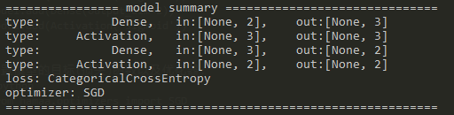
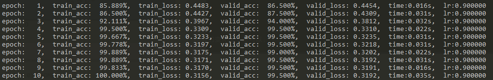
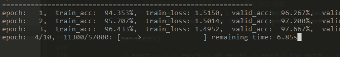
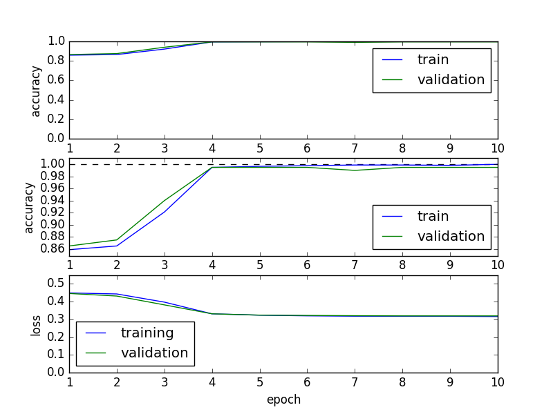
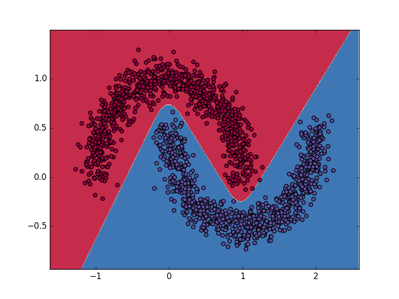
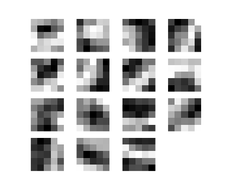

<p align="center">
	
</p>

## Hamaa: a Simple and Naive Deep Learning library 

[](http://hamaa.readthedocs.io/zh_CN/latest/?badge=latest) 
[](https://travis-ci.org/monitor1379/hamaa)
[](https://raw.githubusercontent.com/monitor1379/hamaa/master/LICENSE)
[](https://codecov.io/gh/monitor1379/hamaa)

### What is Hamaa

- Hamaa是一个构建于Python/NumPy之上的深度学习库，
类[Keras](http://keras.io)的API以及模块化的设计使得用Hamaa来搭建神经网络就像搭建积木一样简单。
- 之所以编写Hamaa，是因为作者在学习DL时发现，
虽然网络上与DL相关的论文、教程与框架浩如烟海，
但是这些要么全是数学公式、要么并没有教怎么去实现、要么为了提升速度牺牲了源代码的可读性，
所以作者尝试着自己编写一个简单、朴素的深度学习库，写着写着就有了Hamaa。
- 所以，Hamaa的出现**并不是为了取代(当然也没有这个能力去取代)工业界上常用的深度学习框架**
(诸如
[TensorFlow](https://www.tensorflow.org/)、
[Theano](http://www.deeplearning.net/software/theano/)、
[Caffe](http://caffe.berkeleyvision.org/)、
[MXNet](http://mxnet.readthedocs.io/en/latest/)
等等)；
- 相反，Hamaa被创造的目的是**希望让深度学习的初学者能够通过使用、
阅读Hamaa的源代码甚至去重现Hamaa来加深对神经网络/深度学习的理解**，
以便更好地去使用上述几个工业级别的深度学习框架去解决实际问题（而不是成为一个调包/调参侠 :D）。

---

### The Design Philosophy of Hamaa


Hamaa始终遵循着`too SIMPLE and sometimes NAIVE`的原则来设计：
- **每一个可配置项都抽象成简单的模块**。 具体地，网络层、损失函数、优化器、初始化策略、激活函数都是独立
的模块，能够通过自由组装的方式来搭建模型。
- **所有模块都使用朴素的代码实现**。每一段源代码都希望能在第一次阅读时显得直观易懂，具有良好的可读性，
并且不过分使用trick。


Hamaa尽管在速度优化上没有工业级别的深度学习框架要好，
但Hamaa也具有以下优点:

- **安装依赖少，无需配置**。如果你想要进行一些简单的快速实验，又不想花大量时间在搭建与配置环境上的话， 
那么基于Python的Hamaa可能是不错的选择。
- **使用简单**。学会使用Hamaa搭建一个完整的神经网络并进行数据可视化仅需不到1分钟(可查看下面的Getting Started一节)。
此外如果你熟悉[Keras](http://keras.io)的话将能更快地上手。
- **源码易读**。朴素的设计模式、丰富的源码注释以及完备的设计文档能够让你深入理解Hamaa是如何将复杂的数学公式转化成实际的工程代码。
- **扩展性强**。Hamaa支持通过实现接口的方式来自定义模块。

更多链接：

- Hamaa使用文档 : [hamaa.readthedocs.io](http://hamaa.readthedocs.io)。
- Hamaa设计文档 : [完善中](FIXME)
- Hamaa已支持的所有特性 : [DEVELOP.md](DEVELOP.md)
- Hamaa的未来计划：[TODO.md](TODO.md)

因本人水平有限，如有错误与不足之处诚请指出 :D (可在issues中提出)

--- 

### Installation

支持:
- Windows、Linux
- Python 2.x (后续将支持Python 3.x版本)

Hamaa使用了下述4个依赖库: 

```
numpy>=1.9
matplotlib>=1.5
nose>=1.3
Pillow>=3.4
```

打开`shell`或者`cmd`，输入下述命令

```
# 下载源代码到本地
>> git clone git@github.com:monitor1379/hamaa.git

# 输入下述命令，依次进行安装依赖、编译Hamaa中的Python C扩展、安装Hamaa
>> cd hamaa
>> pip install -r requirements.txt
>> python setup.py build_ext
>> pip install .
```


--- 

### Getting started: 1 minutes to Hamaa

在Hamaa中，一个神经网络模型被称为一个model，
其中最基础的一种model叫做`Sequential`，即将网络层按序列依次堆叠而成。

- 这是一个`Sequential`模型:
```python
from hamaa.models import Sequential

model = Sequential()
```

- 添加网络层只需使用`add()`:

```python
from hamaa.layers import Dense, Activation

model.add(Dense(input_dim=2, output_dim=4))
model.add(Activation('sigmoid'))
model.add(Dense(output_dim=2))
model.add(Activation('softmax'))
```

- 设置模型的目标(损失)函数以及优化器:
```python
from hamaa.optimizers import SGD

model.set_objective('categorical_crossentropy')
model.set_optimizer(SGD(lr=0.03, momentum=0.5))
```

- 打印模型的详细信息:
```python
print model.summary()
```



- 加载数据集（此处采用moons数据集，为两个半弧形组成）,并切分其中0.9作为训练集，剩下0.1作为验证集
```python
from hamaa.datasets import datasets
from hamaa.utils.np_utils import split_training_data

x, y = datasets.load_moons_data(nb_data=2000, noise=0.1)
training_data, validation_data = split_training_data(data=(x, y), split_ratio=0.9)
```

- 接下来就可以开始训练模型:
```python
model.train(training_data=training_data,
            nb_epochs=40,
            mini_batch_size=100,
            verbose=1,
            validation_data=validation_data,
            log_epoch=1)
```

训练信息如下图所示:


如果每个epoch耗时比较长，还可以使用进度条功能:


- 训练完之后评估模型的准确率:
```python
print model.evaluate_accuracy(x, y) 
```

- 如果你想直观地查看模型的训练/验证准确率与损失函数值随着训练周期的变化图，可以:
```python
model.plot_training_iteration()
```

<p align="center">
	
</p>


- 最后，如果数据集是二维数据，那么还可以画出决策边界:

```python
model.plot_prediction(data=training_data)
```

<p align="center">
	
</p>

---

### Examples

更多样例程序:

#### examples/example1_or_nn.py

使用Hama构建单层神经网络来解决或问题的一个简洁的例子。
其中包含了创建、训练、测试一个神经网络必备的所有函数。

```python

from hamaa.datasets import datasets
from hamaa.layers import Dense, Activation
from hamaa.models import Sequential
from hamaa.optimizers import SGD


def run():
    # 1. create a model
    model = Sequential()

    # 2. add a full connected layer to model
    model.add(Dense(input_dim=2, output_dim=2, init='uniform'))

    # 3. add a activation layer to model
    model.add(Activation('sigmoid'))

    # 4. use "mean square error" as the objective of model
    model.set_objective('mse')

    # 5. use "stochastic gradient descent" as the optimizerof model
    model.set_optimizer(SGD(lr=0.9, momentum=0.9, decay=1e-6))

    # 6. print the summary of model
    print model.summary()

    # 7. load "or" data, note that the label "y" is one hot
    #    x = np.array([[0, 0], [0, 1], [1, 0], [1, 1]])
    #    y = np.array([[1, 0], [0, 1], [0, 1], [0, 1]])
    x, y = datasets.load_or_data()

    # 8. train the neural network
    model.train(training_data=(x, y), nb_epochs=10)

    # 9. evaluate the accuracy on data
    print 'test accuracy: ', model.evaluate_accuracy(x, y)


if __name__ == '__main__':
    run()

``` 

---

#### examples/example2_moons_nn.py

构建一个神经元数目为 [2->3->2] 的多层神经网络来对线性不可分数据集进行分类。

```python

from hamaa.datasets import datasets
from hamaa.layers import Dense, Activation
from hamaa.models import Sequential
from hamaa.optimizers import SGD
from hamaa.utils.np_utils import split_training_data


def run():
    model = Sequential()
    model.add(Dense(input_dim=2, output_dim=4, init='normal'))
    model.add(Activation('sigmoid'))
    model.add(Dense(output_dim=2))
    model.add(Activation('softmax'))
    model.set_objective('categorical_crossentropy')
    model.set_optimizer(SGD(lr=0.03, momentum=0.5))

    print model.summary()

    x, y = datasets.load_moons_data(nb_data=2000, noise=0.1)

    # split nine in tenth of original data as training data, and the rest as validation data
    training_data, validation_data = split_training_data(data=(x, y), split_ratio=0.9)

    # "verbose" means display mode of training information
    # "log_epoch" means display training information every log_epoch times
    model.train(training_data=training_data,
                nb_epochs=40,
                mini_batch_size=100,
                verbose=1,
                validation_data=validation_data,
                log_epoch=1)

    print 'test accuracy: ', model.evaluate_accuracy(x, y)

    # plot the prediction on training_data and validation_data
    model.plot_prediction(data=training_data)
    model.plot_prediction(data=validation_data)

    # plot a line chart about accuracy and loss with epoch.
    model.plot_training_iteration()


if __name__ == '__main__':
    run()


```

---

#### examples/example3_mnist_nn.py

构建一个多层神经网络来对MNIST数据集进行分类。
使用进度条功能来显示过程。

```python

from hamaa.datasets.datasets import load_mnist_data
from hamaa.layers import Dense, Activation
from hamaa.models import Sequential
from hamaa.optimizers import SGD
from hamaa.utils.np_utils import split_training_data


def run():
    print 'loading MNIST dataset...'
    # "preprocess" means normalization
    training_data, test_data = load_mnist_data(nb_training=60000, nb_test=10000, preprocess=True, flatten=True)
    training_data, validation_data = split_training_data(training_data, split_ratio=0.95)

    print 'training_data:', training_data[0].shape
    print 'validation_data:', validation_data[0].shape
    print 'test_data:', test_data[0].shape

    model = Sequential()
    model.add(Dense(input_dim=784, output_dim=100, init='glorot_normal'))
    model.add(Activation('sigmoid'))
    model.add(Dense(output_dim=10, init='glorot_normal'))
    model.add(Activation('softmax'))
    model.set_objective('categorical_crossentropy')
    model.set_optimizer(SGD(lr=0.01, momentum=0.1))

    print model.summary()

    model.train(training_data=training_data,
                nb_epochs=10,
                mini_batch_size=100,
                verbose=2,
                validation_data=validation_data,
                log_epoch=1)

    print 'test accuracy:', model.evaluate_accuracy(test_data[0], test_data[1])
    model.plot_training_iteration()


if __name__ == '__main__':
    run()

```

---

#### examples/example4_mnist_cnn.py

构建一个卷积神经网络来对MNIST数据集进行分类。
使用进度条功能来显示过程，并使用可视化工具对卷积层
权重进行可视化。

```python

from hamaa.datasets.datasets import load_mnist_data
from hamaa.layers import Dense, Activation, Convolution2D, Flatten, MeanPooling2D
from hamaa.models import Sequential
from hamaa.optimizers import SGD
from hamaa.utils import vis_utils
from hamaa.utils.np_utils import split_training_data


print 'loading MNIST dataset...'
training_data, test_data = load_mnist_data(nb_training=3000, nb_test=10000, preprocess=True, flatten=False)
training_data, validation_data = split_training_data(training_data, nb_validation=1000)

print 'training_data:', training_data[0].shape
print 'validation_data:', validation_data[0].shape
print 'test_data:', test_data[0].shape

model = Sequential()
model.add(Convolution2D(nb_kernel=5, kernel_height=5, kernel_width=5, activation='tanh', input_shape=(1, 28, 28)))
model.add(MeanPooling2D(pooling_size=(2, 2)))
model.add(Convolution2D(nb_kernel=5, kernel_height=5, kernel_width=5, activation='tanh'))
model.add(MeanPooling2D(pooling_size=(2, 2)))
model.add(Flatten())
model.add(Dense(output_dim=30, init='glorot_normal'))
model.add(Activation('sigmoid'))
model.add(Dense(output_dim=10, init='glorot_normal'))
model.add(Activation('softmax'))

model.set_objective('categorical_crossentropy')
model.set_optimizer(SGD(lr=0.03, momentum=0.1))

print model.summary()

model.train(training_data=training_data,
            nb_epochs=30,
            mini_batch_size=50,
            verbose=2,
            validation_data=validation_data,
            log_epoch=1)

print model.evaluate_accuracy(test_data[0], test_data[1])

# visualize the kernels of convolution layer
vis_utils.visualize_convolution_kernel(model.layers[0], title='layer 0')
vis_utils.visualize_convolution_kernel(model.layers[2], title='layer 2')

model.plot_training_iteration()


```

在MNIST数据集上测试准确率达到99.3%的卷积神经网络卷积核可视化示意图：
(**注**: 非来自上述程序)

<p align="center">
      
</p>


### dev branch

[](http://hamaa.readthedocs.io/zh_CN/latest/?badge=latest) 
[](https://travis-ci.org/monitor1379/hamaa)
[](https://codecov.io/gh/monitor1379/hamaa)

<script>
var _hmt = _hmt || [];
(function() {
  var hm = document.createElement("script");
  hm.src = "https://hm.baidu.com/hm.js?2b568b07f96780d51b81cba1f832e8aa";
  var s = document.getElementsByTagName("script")[0]; 
  s.parentNode.insertBefore(hm, s);
})();
</script>
