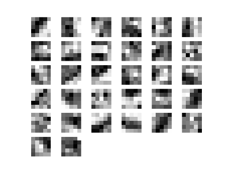
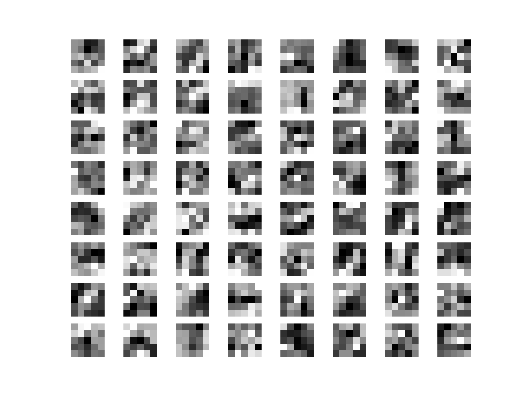

# 例子 Examples

下面给出的所有例子程序都能在`examples`文件夹中找到：[GitHub地址](https://github.com/monitor1379/hamaa/tree/master/examples)。

## example1_or_nn.py

用Hamaa构建单层神经网络来解决"或问题"的一个简洁的例子。
其中包含了创建、训练、测试一个神经网络必备的所有函数。

```python

from hamaa.datasets import datasets
from hamaa.layers import Dense, Activation
from hamaa.models import Sequential
from hamaa.optimizers import SGD


# 1. create a model
model = Sequential()

# 2. add a full connected layer to model
model.add(Dense(input_dim=2, output_dim=2, init='uniform'))

# 3. add a activation layer to model
model.add(Activation('sigmoid'))

# 4. use "mean square error" as the objective of model
model.set_objective('mse')

# 5. use "stochastic gradient descent" as the optimizerof model
model.set_optimizer(SGD(lr=0.9, momentum=0.9, decay=1e-6))

# 6. print the summary of model
print model.summary()

# 7. load "or" data, note that the label "y" is one hot
#    x = np.array([[0, 0], [0, 1], [1, 0], [1, 1]])
#    y = np.array([[1, 0], [0, 1], [0, 1], [0, 1]])
x, y = datasets.load_or_data()

# 8. train the neural network
model.train(training_data=(x, y), nb_epochs=10)

# 9. evaluate the accuracy on data
print 'test accuracy: ', model.evaluate_accuracy(x, y)

``` 

---

## example2_moons_nn.py

构建一个神经元数目为 [2->4->2] 的多层神经网络来对线性不可分数据集进行分类。

```python

from hamaa.datasets import datasets
from hamaa.layers import Dense, Activation
from hamaa.models import Sequential
from hamaa.optimizers import SGD
from hamaa.utils.np_utils import split_training_data


model = Sequential()
model.add(Dense(input_dim=2, output_dim=4, init='normal'))
model.add(Activation('sigmoid'))
model.add(Dense(output_dim=2))
model.add(Activation('softmax'))
model.set_objective('categorical_crossentropy')
model.set_optimizer(SGD(lr=0.01, momentum=0.9))

print model.summary()

x, y = datasets.load_moons_data(nb_data=2000, noise=0.1)

# split nine in tenth of original data as training data, and the rest as validation data
training_data, validation_data = split_training_data(data=(x, y), split_ratio=0.9)

# "verbose" means display mode of training information
# "log_epoch" means display training information every log_epoch times
model.train(training_data=training_data,
            nb_epochs=30,
            mini_batch_size=100,
            verbose=1,
            validation_data=validation_data,
            log_epoch=1)

print 'test accuracy: ', model.evaluate_accuracy(x, y)

# plot the prediction on training_data and validation_data
model.plot_prediction(data=training_data)
model.plot_prediction(data=validation_data)

# plot a line chart about accuracy and loss with epoch.
model.plot_training_iteration()


```

---

## example3_mnist_nn.py

构建一个多层神经网络来对MNIST数据集进行分类。
使用进度条功能来显示训练过程。

```python

from hamaa.datasets.datasets import load_mnist_data
from hamaa.layers import Dense, Activation
from hamaa.models import Sequential
from hamaa.optimizers import SGD
from hamaa.utils.np_utils import split_training_data


print 'loading MNIST dataset...'
# "preprocess" means normalization
training_data, test_data = load_mnist_data(nb_training=60000, nb_test=10000, preprocess=True, flatten=True)
training_data, validation_data = split_training_data(training_data, split_ratio=0.95)

print 'training_data:', training_data[0].shape
print 'validation_data:', validation_data[0].shape
print 'test_data:', test_data[0].shape

model = Sequential()
model.add(Dense(input_dim=784, output_dim=100, init='glorot_normal'))
model.add(Activation('sigmoid'))
model.add(Dense(output_dim=10, init='glorot_normal'))
model.add(Activation('softmax'))
model.set_objective('categorical_crossentropy')
model.set_optimizer(SGD(lr=0.01, momentum=0.9))

print model.summary()

model.train(training_data=training_data,
            nb_epochs=10,
            mini_batch_size=100,
            verbose=2,
            validation_data=validation_data,
            log_epoch=1)

print 'test accuracy:', model.evaluate_accuracy(test_data[0], test_data[1])
model.plot_training_iteration()


```

---

## example4_mnist_cnn.py

构建一个卷积神经网络来对MNIST数据集进行分类。
使用进度条功能来显示训练过程，
并使用可视化工具对卷积层权重进行可视化。

```python


from hamaa.datasets.datasets import load_mnist_data
from hamaa.layers import Dense, Activation, Convolution2D, Flatten, MeanPooling2D
from hamaa.models import Sequential
from hamaa.optimizers import SGD
from hamaa.utils import vis_utils
from hamaa.utils.np_utils import split_training_data


print 'loading MNIST dataset...'
training_data, test_data = load_mnist_data(nb_training=6000, nb_test=10000, preprocess=True, flatten=False)
training_data, validation_data = split_training_data(training_data, nb_validation=1000)

print 'training_data:', training_data[0].shape
print 'validation_data:', validation_data[0].shape
print 'test_data:', test_data[0].shape

model = Sequential()
model.add(Convolution2D(nb_kernel=5, kernel_height=5, kernel_width=5, activation='relu', input_shape=(1, 28, 28)))
model.add(MeanPooling2D(pooling_size=(2, 2)))
model.add(Convolution2D(nb_kernel=5, kernel_height=5, kernel_width=5, activation='relu'))
model.add(MeanPooling2D(pooling_size=(2, 2)))
model.add(Flatten())
model.add(Dense(output_dim=100, init='glorot_normal'))
model.add(Activation('sigmoid'))
model.add(Dense(output_dim=10, init='glorot_normal'))
model.add(Activation('softmax'))

model.set_objective('categorical_crossentropy')
model.set_optimizer(SGD(lr=0.002, momentum=0.9))

print model.summary()

model.train(training_data=training_data,
            nb_epochs=20,
            mini_batch_size=64,
            verbose=2,
            validation_data=validation_data,
            log_epoch=1)

print model.evaluate_accuracy(test_data[0], test_data[1])

# visualize the kernels of convolution layer
vis_utils.visualize_convolution_kernel(model.layers[0], title='layer 0')
vis_utils.visualize_convolution_kernel(model.layers[2], title='layer 2')

model.plot_training_iteration()

```

在MNIST数据集上测试准确率达到99.3%的卷积神经网络卷积核可视化示意图：
(**注**: 非来自上述程序)

第一个卷积层:



第二个卷积层:


